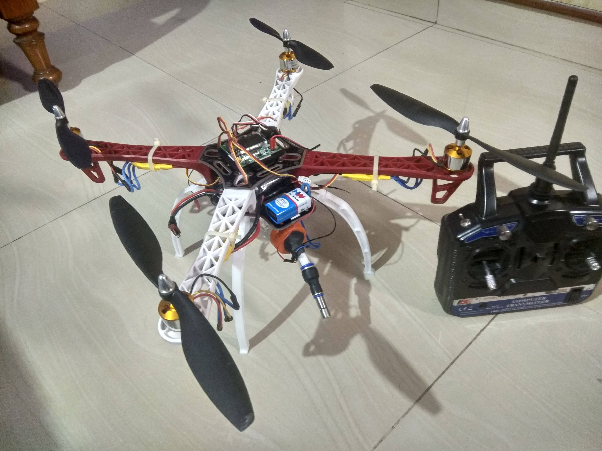

# Agricultural Spraying Drone

This prototype drone is used to spray pesticides on plants and trees. The Flight controller used here is the kk 2.1.5 FC which has an inbuilt gyro and accelerometer. The X-Quadcopter Motor Layout is followed.

## Quadcopter

 

## Components

- F450 Frame
- 1000KV Brushless DC Motors (A2212/13T) * 4 
- 30A ESC (Electronic Speed Controllers)
- KK 2.1.5 Flight Controller
- FS-CT6B 
- LiPo Battery 3300 mah, 25C, 11.1V
- Propellers (10 * 4.5)
- Servo motor
- Push Button switch
- DC motor 6V
- 9V Battery and its connector to power servo
- Pipe which fits DC motor
- Bottle
- Nozzle holder and Nozzle

[Here](https://www.youtube.com/watch?v=jUMeFc8tEBM) is a video which shows the overall structure of the Quadcopter.

## Build

There are plenty of online videos and articles which will help you in building a drone.  
The spraying mechanism is made with a bottle which has a big enough cap to fit the DC motor inside the bottle. The DC motor is fitted with a pipe which comes out of the bottle cap and the nozzle is fitted to the pipe. The DC motor is connected to a push button switch and 9V Battery. A servo motor is used to click on the switch which will inturn power up the DC motor. The servo motor is controlled by a transmitter and it is connected to one of the reciever's channel.

[Here](https://www.youtube.com/watch?v=ozpDTH2iNXM) is a video of which shows the workings of spraying mechanism.